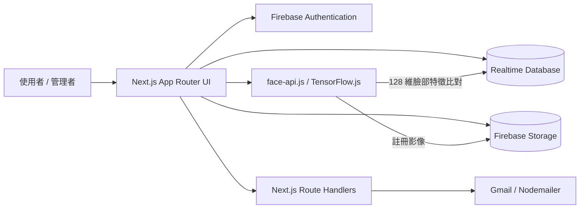

# 翰霖 ERP 打卡系統

以 Next.js 14、Firebase 與 face-api.js 建置的企業打卡與出勤管理系統。專案採用 App Router，提供帳號驗證、上下班打卡、人臉註冊、手動補登、出勤資料查詢及電子郵件通知等功能。

## 主要功能

- Firebase Authentication 使用者登入與權限控管
- 一般打卡及人臉辨識相關流程
- 個人、學生與整體打卡紀錄查詢
- 手動補登及出勤管理
- Firebase Realtime Database 與 Storage 整合
- 透過 Gmail 寄送系統通知

## 技術架構

- Next.js 14 / React 18
- Tailwind CSS
- Firebase Web SDK 與 Firebase Admin SDK
- TensorFlow.js / face-api.js
- Nodemailer

### 系統架構



瀏覽器負責畫面、相機存取與人臉特徵計算；Firebase 提供身分驗證、打卡資料與影像儲存；需要保護憑證的郵件功能則由伺服器端 Route Handler 執行。

## 功能畫面與操作流程

| 畫面 | 路由 | 操作重點 |
| --- | --- | --- |
| 系統授權 | `/authorization` | 登入後檢查帳號是否具有「打卡機」角色 |
| 打卡機 | `/punch-system/main-punch` | 選擇上下班、掃描 QR Code 或以人臉辨識身分，完成後寫入打卡紀錄 |
| 人臉註冊 | `/punch-system/face-regist` | 搜尋員工、拍照或上傳照片，再建立特徵資料 |
| 手動補登 | `/punch-system/punch-manual` | 由主管新增例外打卡紀錄 |
| 出勤與查詢 | `/punch-system/attendance` 等 | 依角色查看個人、學生或整體出勤資料 |

> 作品集發布時，建議將去識別化畫面放在 `docs/screenshots/`，並於本節加入打卡、人臉註冊及出勤查詢截圖。截圖不得包含姓名、Email、UID、臉部影像或真實出勤紀錄。

## 開始使用

### 環境需求

- Node.js 18.17 或更新版本
- npm
- 可用的 Firebase 專案

### 安裝與啟動

1. 複製專案並安裝鎖定版本的套件：

```bash
git clone <repository-url>
cd punch-system
npm ci
```

2. 在 Firebase Console 建立專案，啟用 Email/Password Authentication、Realtime Database 與 Storage，並將 Web App 設定填入 `src/config/firebaseConfig.js`。建立測試帳號後，在 `users/{uid}` 寫入姓名、部門與角色（例如 `打卡機`、`主管` 或 `老師`）。

3. 在專案根目錄建立 `.env.local`，設定郵件服務：


```env
GMAIL_USER=your-account@gmail.com
GMAIL_APP_PASSWORD=your-google-app-password
```

`GMAIL_APP_PASSWORD` 應使用 Google 應用程式密碼，不要填入一般帳號密碼。請勿提交 `.env.local` 或任何服務帳戶私鑰。

4. 啟動開發環境：

```bash
npm run dev
```

開啟 [http://localhost:3000](http://localhost:3000)，先至 `/authorization` 完成打卡機授權。相機功能須在 `localhost` 或 HTTPS 環境使用。

## 常用指令

```bash
npm run dev    # 啟動開發伺服器
npm run lint   # 執行 Next.js ESLint 檢查
npm run build  # 建立正式環境版本
npm start      # 啟動已建置的正式版本
```

目前尚未設定自動化測試。提交變更前，請至少執行 `npm run lint` 與 `npm run build`，並手動驗證受影響的頁面及 Firebase 操作。

## 專案結構

```text
src/
├── app/          # 頁面、版面配置與 API Route Handlers
├── components/   # 共用 React 元件
├── config/       # Firebase 用戶端設定
├── context/      # 驗證、重新導向與登出狀態
└── hooks/        # 共用 Hooks 與存取控制邏輯
public/
└── models/       # face-api.js 模型與權重檔
```

`jsconfig.json` 已設定 `@/*` 對應 `src/*`，匯入模組時可使用 `@/components/...`。

## 主要路由

| 路由 | 用途 |
| --- | --- |
| `/login` | 使用者登入與登出 |
| `/tasks` | 分部需求表 |
| `/punch-system/main-punch` | 主要打卡頁面 |
| `/punch-system/face-regist` | 人臉資料註冊 |
| `/punch-system/punch-manual` | 手動補登 |
| `/punch-system/attendance` | 出勤管理 |
| `/punch-system/query-self-data` | 個人打卡紀錄 |
| `/punch-system/query-student-data` | 學生資料查詢 |
| `/punch-system/query-punch-data` | 打卡資料查詢 |

## 設計決策

- **App Router 分層：** 頁面與 API 位於同一個 Next.js 專案，降低小型團隊部署與維護成本。
- **瀏覽器端人臉推論：** 模型由 `public/models/` 載入，影像在裝置端轉為特徵，減少額外辨識服務與網路延遲。
- **多重識別方式：** QR Code 與人臉辨識並存，讓相機、光線或模型辨識失敗時仍有替代流程。
- **角色導向介面：** `useIamAccess` 依 `users/{uid}/role` 控制打卡機、主管及老師可見功能；後端資料仍必須以 Firebase Security Rules 再次授權，不能只依賴前端隱藏畫面。

## 人臉資料與隱私設計

註冊流程會將原始影像存於 Storage 的 `face_images/{uid}.jpg`，並將臉部特徵向量與影像 URL 存於 Realtime Database 的 `users/{uid}`。兩者皆屬可識別個人的敏感資料，不應視為一般圖片或匿名數值。

- 蒐集前應取得明確同意，說明打卡用途、保存期間、使用範圍及撤回方式；不得轉作其他辨識或分析用途。
- 僅「打卡機」角色可進入註冊與辨識畫面；正式環境須以 Database／Storage Rules 強制每筆資料的讀寫權限，採最小權限並保留管理操作紀錄。
- 查詢畫面、日誌、錯誤訊息與作品集截圖不得輸出特徵向量、下載 URL 或可識別資訊。
- 設定明確保存期限；員工離職、撤回同意或目的消失時，應同步刪除 Storage 影像、Database 特徵與相關備份。
- 傳輸僅使用 HTTPS，備份與匯出資料需加密。正式上線前應完成權限規則測試、隱私告知與資料刪除流程。

目前程式中的 `useIamAccess` 屬用戶端畫面控制，不等同伺服器端安全邊界。作品集展示可描述上述目標設計，但正式部署前仍須確認 Firebase Rules 已實作並通過 Emulator 測試。

## 安全性注意事項

Firebase 規則、管理員憑證、OAuth 密鑰與郵件密碼皆應由環境變數或部署平台的 Secret 管理。正式部署前，請檢查 `src/app/api/` 與 `src/config/`，移除硬編碼的敏感資料並輪替任何曾提交到版本庫的密鑰。

## 貢獻方式

開發與提交規範請參閱 [AGENTS.md](./AGENTS.md)。Pull Request 應說明變更內容、驗證方式及相關議題；介面調整請附上截圖。
